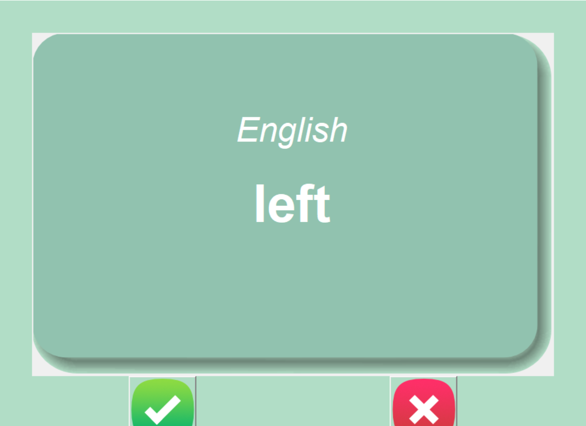

# FlashCard Game

This is a simple flashcard game built using Python's Tkinter library. It allows users to learn and memorize French words and their English translations.

## How It Works

1. Upon running the program, a window titled "FlashCard Game" opens.

2. The program reads a CSV file containing French words and their English translations. If the file is not found, it creates a new one from another CSV file containing original French words.

3. The game displays a flashcard with a French word on the front.

4. After 3 seconds, the card flips, revealing the English translation on the back.

5. The user can then click on the "Known" button if they know the translation, or the "Unknown" button if they don't.

6. If the "Known" button is clicked, the current word is removed from the list of words to learn, and the next card is displayed.

## Files

- **main.py**: Contains the Python code for the flashcard game.
- **data/french_words.csv**: CSV file containing original French words.
- **data/words_to_learn.csv**: CSV file containing French words to learn. This file is created if it doesn't exist.
- **images**: Directory containing image files used for the flashcard interface.

## Dependencies

- **pandas**: Used for reading and writing CSV files.
- **Tkinter**: Python's standard GUI library for creating graphical user interfaces.

## How to Run

1. Make sure you have Python installed on your system.
2. Install the required dependencies (`pandas`).
3. Run the `main.py` file using Python.

## How to Play

- Upon running the program, a window will open displaying a flashcard with a French word.
- Wait for 3 seconds for the card to flip and reveal the English translation.
- Click the "Known" button if you know the translation, or the "Unknown" button if you don't.
- The program will proceed to the next card automatically if the "Known" button is clicked.

## Screenshot

